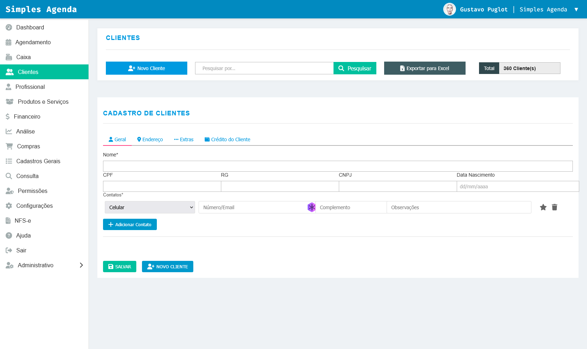

# SipubTechTeste

Este projeto foi desenvolvido como parte de um desafio técnico para a SipubTech, utilizando [Angular CLI](https://github.com/angular/angular-cli) versão 19.2.10.

## Sobre o Desafio

O objetivo do desafio é criar uma aplicação Angular para gestão de clientes, com foco em boas práticas de UI/UX, organização de código e responsividade.

Principais requisitos:

- Layout com sidebar fixa e navegação entre páginas.
- Tela de cadastro de clientes com campos: Nome, CPF, RG, CNPJ, Data de Nascimento e área dinâmica para contatos (telefone, e-mail, residencial).
- Funcionalidades de pesquisa, exportação para Excel e contagem total de clientes.
- Utilização de componentes reutilizáveis e SCSS modularizado.

## Observação Pessoal

> **Nota:** Estou em processo de aprendizado em Angular e este projeto representa meus primeiros passos utilizando o framework. Busquei aplicar os conceitos aprendidos até aqui, explorando a estrutura de componentes, rotas, estilização com SCSS e integração de funcionalidades básicas.

## Como executar o projeto

1. Instale as dependências:

   ```bash
   npm install
   ```

2. Inicie o servidor de desenvolvimento:
   ```bash
   ng serve
   ```
   Depois, acesse [http://localhost:4200/](http://localhost:4200/) no navegador.

## Observações

- **Não há testes automatizados implementados neste projeto.**
- O foco foi a implementação da interface, navegação e funcionalidades principais do desafio.

## Imagens

### Modelo proposto pelo desafio


### Resultado alcançado



## Recursos adicionais

- [Documentação Angular CLI](https://angular.dev/tools/cli)
- [Documentação Angular](https://angular.dev/)
